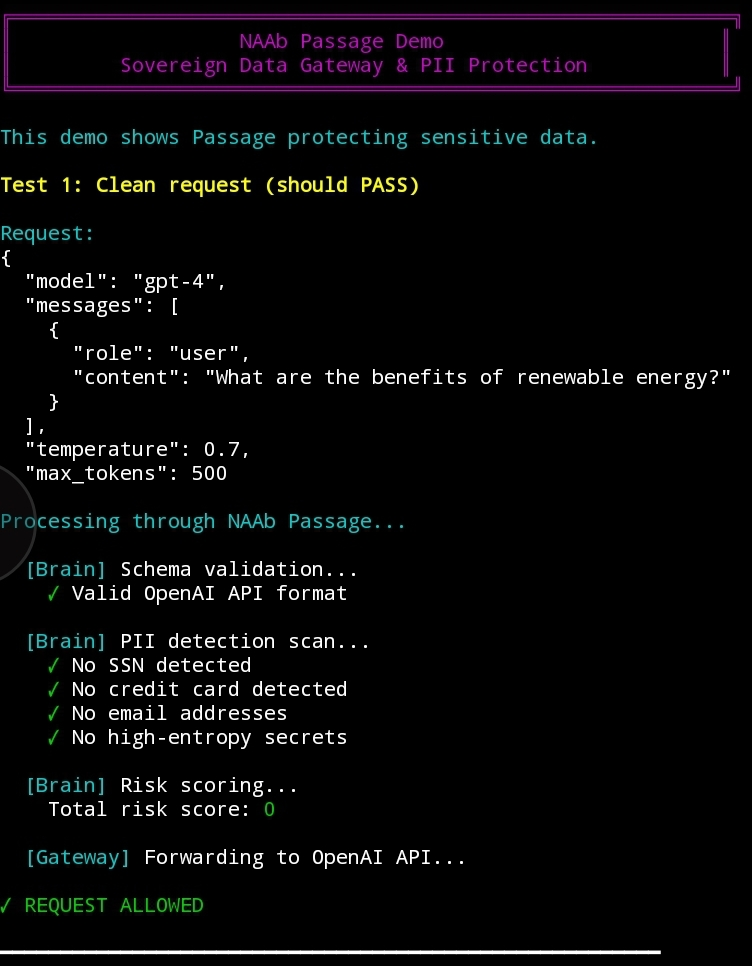
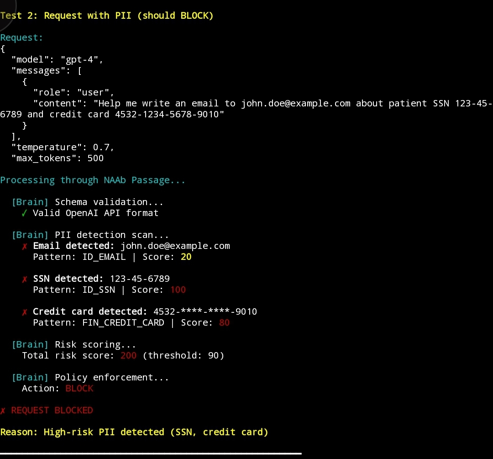
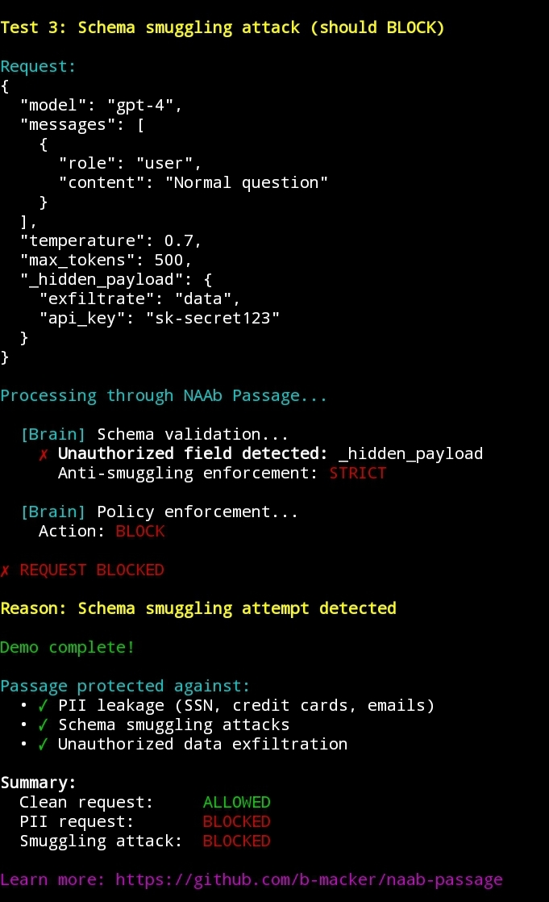

# NAAb Passage

[](https://github.com/b-macker/naab-passage/actions/workflows/ci.yml)
[](https://github.com/b-macker/naab-passage/actions/workflows/security-scan.yml)
[](https://github.com/b-macker/naab-passage/releases/tag/v1.0.0)
[](LICENSE)
[](https://github.com/b-macker/NAAb)
[](CONTRIBUTING.md)
[](https://github.com/b-macker/naab-passage/discussions)

**Sovereign data gateway and PII protection platform** built on the [NAAb Language](https://github.com/b-macker/NAAb). Ensures secure passage for sensitive data by validating schemas, detecting PII, and enforcing policies before data reaches untrusted systems.

```
Input:  API request with potential PII
Output: Validated, redacted, or blocked request
Result: Zero PII leakage with mathematical certainty
```

---

## Why NAAb Passage?

- **Sovereign Architecture** — NAAb owns all decisions, polyglot workers are "dumb muscle"
- **Self-Synthesizing** — Compiles binaries at boot, SHA-256 verified
- **Hardware Isolation** — CPU pinning, network namespaces
- **Anti-Smuggling** — Strict schema enforcement
- **Privacy-First** — HIPAA, GDPR, SOC2 compliant

---

## Demo

See NAAb Passage in action detecting and blocking PII leakage:

### Test 1: Clean Request ✅
**Safe API request with no sensitive data** → ALLOWED



### Test 2: PII Detection 🚫
**Request containing SSN, credit card, and email** → BLOCKED



Passage detected:
- ✗ Email: `john.doe@example.com` (Score: 20)
- ✗ SSN: `123-45-6789` (Score: 100)
- ✗ Credit Card: `4532-****-****-9010` (Score: 80)
- **Total Risk: 200** (threshold: 90) → **BLOCKED**

### Test 3: Schema Smuggling Attack 🚫
**Unauthorized field in request** → BLOCKED



**Try the demo yourself:**
```bash
cd demos
./passage-demo.sh
```

See [DEMO_GUIDE.md](DEMO_GUIDE.md) for recording instructions.

---

## Quick Start

```bash
# Clone with submodule
git clone --recursive https://github.com/b-macker/naab-passage.git
cd naab-passage

# Build NAAb
bash build.sh

# Start gateway
./naab/build/naab-lang main.naab

# Test request (in another terminal)
curl -X POST http://localhost:8091/ -d '{"model": "gpt-4", "messages": ["Hello"]}'
```

---

## Architecture

```
HTTP → Go Gateway → NAAb Brain → Decision
                        ↓
                   Schema ✓
                   PII ✓
                   Risk ✓
```

**Components:**
- **NAAb Brain** (Python) - Sovereign decision engine with PII detection
- **Go Gateway** - HTTP/TLS proxy (forwards to brain via Unix socket)
- **Rust Shield** - Constant-time pattern scanner (network-isolated)

---

## Features

**Security:**
- Self-synthesizing workers with SHA-256 verification
- Forensic source shredding (3-pass overwrite)
- Hardware isolation (CPU pinning via `taskset`, network namespaces via `unshare -n`)
- Anti-smuggling schema validation
- Hash-chained audit logging

**PII Detection:**
- Social Security Numbers (SSN)
- Credit card numbers
- Email addresses
- High-entropy secrets
- Custom patterns via configuration

---

## Configuration

Edit `config/risk_matrix.json` to customize PII policies:

```json
{
    "policies": [
        {"type": "ID_SSN", "score": 100, "action": "BLOCK"},
        {"type": "FIN_CREDIT_CARD", "score": 80, "action": "BLOCK"},
        {"type": "SEC_HIGH_ENTROPY", "score": 40, "action": "REDACT"},
        {"type": "ID_EMAIL", "score": 20, "action": "AUDIT"}
    ],
    "thresholds": {
        "block": 90,
        "redact": 40
    }
}
```

---

## Use Cases

1. **Privacy-First LLM Gateway** - Use ChatGPT/Claude without leaking SSNs, API keys, customer names
2. **Zero-Trust Edge Security** - Protect legacy APIs from injection and malformed data
3. **Self-Healing Security Appliances** - Deploy in hostile clouds, auto-rebuild if tampered

---

## Testing

```bash
# Run test suite
./naab/build/naab-lang verify_vigilant_v7.naab
```

---

## NAAb Ecosystem

- **[NAAb Language](https://github.com/b-macker/NAAb)** — Core polyglot scripting language with governance
- **[NAAb BOLO](https://github.com/b-macker/naab-bolo)** — Code governance & AI validation (50+ checks)
- **[NAAb Pivot](https://github.com/b-macker/naab-pivot)** — Code evolution & optimization (3-60x speedups)
- **NAAb Passage** (this project) — Data gateway & PII protection (zero leakage)

---

## Documentation

- [Getting Started](docs/getting-started.md)
- [Architecture](docs/architecture.md)
- [Security](docs/security.md)
- [Deployment](docs/deployment.md)

---

## License

MIT License - see [LICENSE](LICENSE) for details.

**Brandon Mackert** - [@b-macker](https://github.com/b-macker)

---

_NAAb Passage — Secure passage for sensitive data._
